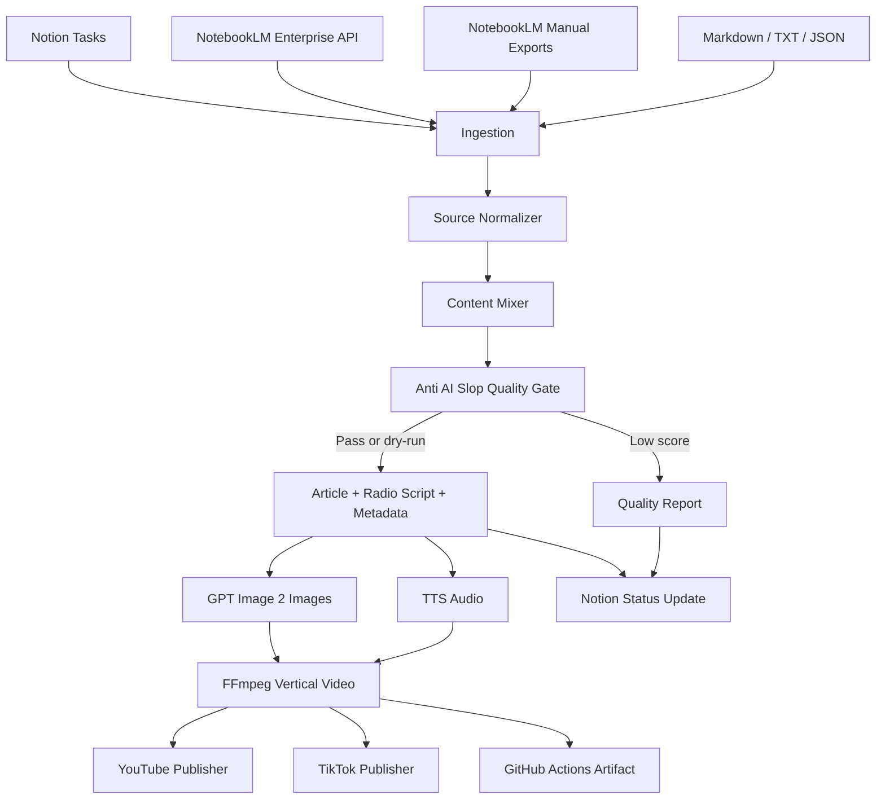

# notion-notebooklm-auto-publisher

Notionのタスク、NotebookLM / NotebookLM Enterpriseのノート・音声概要・手動エクスポート、Markdown/TXT/JSON素材を取り込み、**2つ以上のコンテンツを混ぜ合わせて独自価値を作り**、記事・ラジオ風台本・音声・画像付き縦型動画を生成し、YouTube / TikTokへ自動配信するためのリポジトリです。

AI生成物が「AIスロップ」として扱われないように、単なる要約ではなく、複数ソースの比較、差分、矛盾、具体例、視聴者への実用価値を強制するQuality Gateを標準搭載しています。

## できること

- Notionに配信用タスクを作成、取得、結果更新
- NotebookLM Enterprise APIまたはNotebookLM手動エクスポートを取り込み
- Markdown / TXT / JSON素材を取り込み
- 2つ以上の素材を比較して、記事・ラジオ風台本・概要・説明文・ハッシュタグ・画像プロンプトを生成
- OpenAI `gpt-image-2`で動画用画像を生成
- OpenAI TTSで音声を生成。dry-runでは検証用WAVを自動生成
- Pillow + FFmpegで9:16縦型MP4を生成
- YouTube Data APIで動画投稿
- TikTok Content Posting API Direct Postで動画投稿
- GitHub Actionsで定期実行、手動実行、Artifact保存

## 既存OSSの活用

このリポジトリは、ゼロから全部書かずに既存OSSを安全に利用します。

| 用途 | OSS / 公式ライブラリ |
|---|---|
| CLI | Typer |
| 設定・型 | Pydantic / pydantic-settings |
| HTTP API | HTTPX |
| 画像生成後のプレースホルダー・サムネ | Pillow |
| YouTube投稿 | google-api-python-client / google-auth |
| テスト | pytest |
| Lint | Ruff |
| 動画レンダリング | FFmpeg CLI |

投稿自動化はプラットフォーム規約リスクを避けるため、YouTube/TikTokともに公式APIを使います。非公式スクレイピングでログイン投稿する方式は採用しません。

## アーキテクチャ



## 処理の流れ

1. Notion、NotebookLM、ローカル素材からコンテンツを収集します。
2. 本番モードでは2つ以上の素材がない場合に停止します。
3. Content Mixerが、単なる要約ではなく比較、矛盾、補足、具体例、実用価値を含む記事と台本を作ります。
4. Quality Gateが、独自性、出典反映、汎用AI表現、コピー率、SNS適合を採点します。
5. `gpt-image-2`で動画用画像を作ります。dry-runではPillow画像を作ります。
6. TTSでラジオ風音声を作ります。dry-runでは短い検証用WAVを作ります。
7. FFmpegで縦型MP4を作ります。
8. `--publish` かつ `--dry-run=false` の場合のみ、YouTube/TikTokへ投稿します。
9. 生成物は `dist/` とGitHub Actions Artifactに保存されます。

## 最短実行

```bash
python -m pip install -e '.[dev]'
content-pipeline run --sources data/sample_sources --theme "NotebookLMとNotion素材から独自価値のあるAIラジオを作る" --dry-run --publish
```

出力先は `dist/` です。dry-runでは外部投稿せず、投稿予定JSONだけを保存します。

## GitHub Actionsで全自動実行

Actionsタブから **Generate and Publish Content** を実行します。

- `dry_run=true`: 外部投稿なし。記事、台本、音声、画像、動画、投稿計画をArtifact保存
- `dry_run=false` かつ `publish=true`: Secretsが揃っていればYouTube/TikTokへ投稿

Artifact名: `content-pipeline-outputs`

## 必要なSecrets

| Secret | 用途 |
|---|---|
| `OPENAI_API_KEY` | 台本生成、GPT Image 2画像生成、TTS音声生成 |
| `NOTION_TOKEN` | Notionタスク作成・取得・更新 |
| `NOTION_DATABASE_ID` | NotionタスクDB |
| `YOUTUBE_TOKEN_JSON` | YouTube OAuth refresh token入り認証JSON |
| `TIKTOK_ACCESS_TOKEN` | TikTok Content Posting API用access token |
| `NOTEBOOKLM_ENTERPRISE_ACCESS_TOKEN` | NotebookLM Enterprise API用Bearer token |
| `NOTEBOOKLM_ENTERPRISE_API_BASE` | NotebookLM Enterprise APIベースURL |
| `NOTEBOOKLM_NOTEBOOK_RESOURCE` | NotebookLM Enterprise notebook resource |

詳細は [docs/setup.md](docs/setup.md) を参照してください。

## Notionタスクを作る

```bash
content-pipeline create-notion-task \
  --title "AIラジオ: 2つのNotebookLM素材を混ぜて動画化" \
  --notes "NotionとNotebookLMの素材を統合し、記事・音声・縦動画・YouTube/TikTok投稿まで自動化する" \
  --source-url "https://example.com/source-a" \
  --source-url "https://example.com/source-b"
```

Notion接続が未設定の場合は `dist/notion_task_draft.json` に下書きを保存します。

## 本番で必要なこと

1. Notion Integrationを作成し、タスクDBを共有する
2. OpenAI API KeyをGitHub Secretsへ登録する
3. YouTube OAuth認証JSONを用意する
4. TikTok Developer AppでContent Posting APIを使える状態にする
5. NotebookLM Enterpriseを使う場合はGoogle Cloud側でAPI権限を用意する
6. Actionsの **Generate and Publish Content** を `dry_run=false` / `publish=true` で実行する

外部プラットフォームのOAuth、審査、アプリ承認だけはアカウント所有者の操作が必要です。それ以外の生成・検証・出力は自動化済みです。
