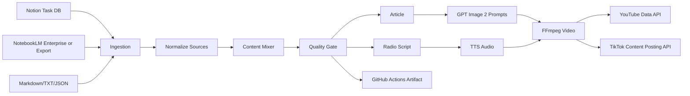

# Architecture

## 全体像

このシステムは、Notionを企画管理、NotebookLMを素材化、Python CLIを自動生成・品質管理・配信エンジンとして扱う構成です。

## OSS利用

- Typer: CLI
- Pydantic: 設定とデータモデル
- HTTPX: Notion/TikTok/NotebookLM API接続
- Pillow: dry-run画像生成
- google-api-python-client: YouTube投稿
- pytest/Ruff: テストと静的チェック
- FFmpeg: 動画レンダリング

## GPT Image 2の使い方

`src/creator_pipeline/media.py` の `MediaBuilder._generate_openai_images` が `OPENAI_IMAGE_MODEL=gpt-image-2` を使います。dry-runまたはAPIキー未設定時はPillowで同じサイズのプレースホルダーを作るため、CIでも安全に検証できます。

## Quality Gate

`src/creator_pipeline/quality.py` が以下を確認します。

- 2つ以上の素材があるか
- 文章量が十分か
- 汎用的なAI表現が多すぎないか
- 比較、反論、矛盾、具体例、実務価値が含まれるか
- 素材が出力に反映されているか
- 元素材と近すぎないか
- 出典・素材の由来が本文にあるか
